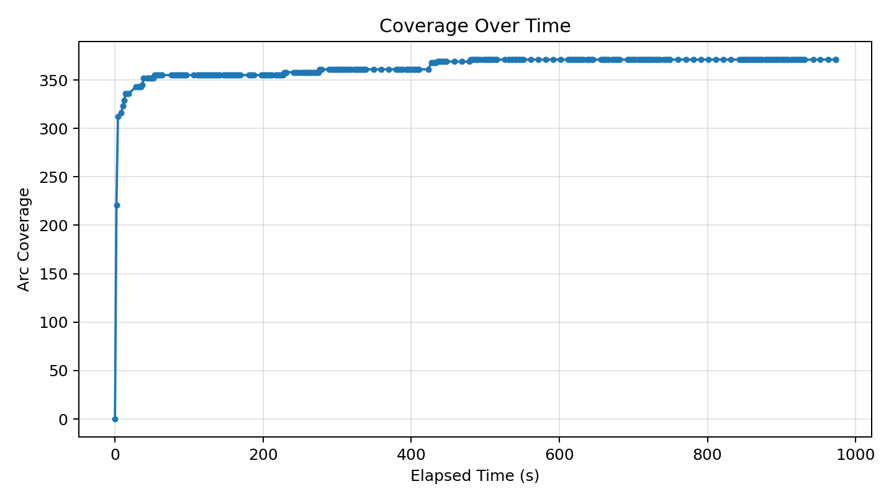
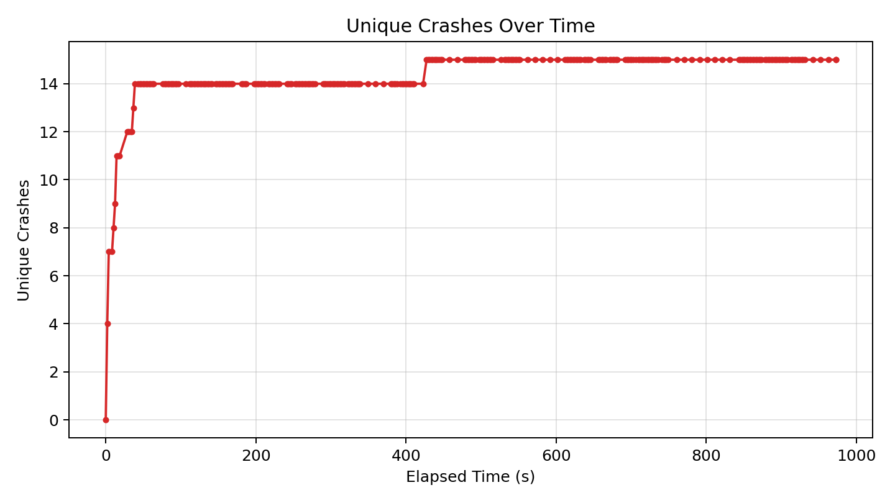
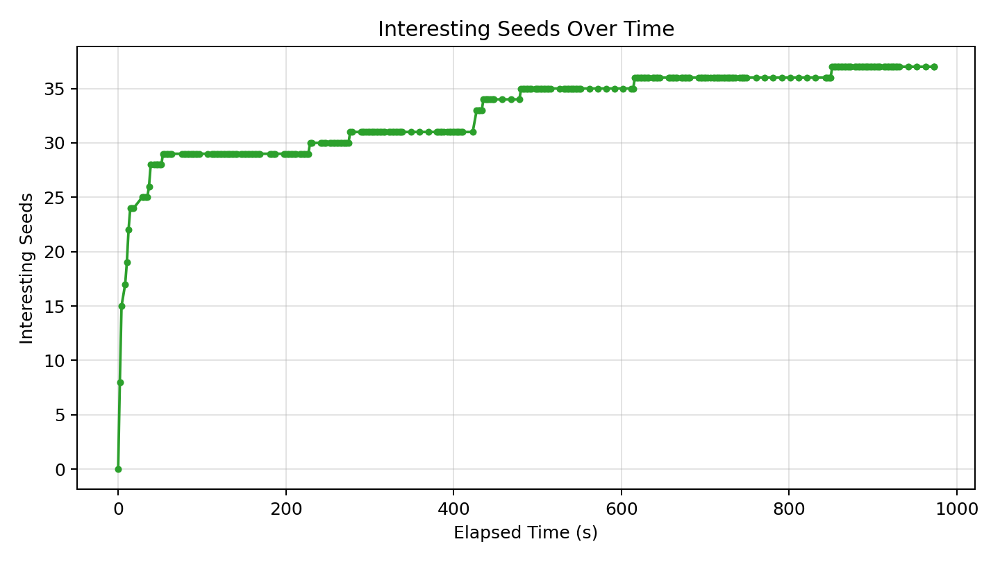

# Fuzzer Run Report (20260417_014842)

_Generated at: 2026-04-17T02:04:55_

## Summary

- **Executions:** 20010
- **Corpus Size:** 38
- **Unique Crashes:** 15
- **Line Coverage:** 295/498 (59.24%)
- **Branch Coverage:** 81/172 (47.09%)
- **Arc Coverage:** 371/590 (62.88%)
- **Exec/s:** 20.57

## Graphs

### Coverage Over Time

### Unique Crashes Over Time

### Interesting Seeds Over Time

## Crash Summary

| Category | Exception | Location | Total Hits | Variants |
|---|---|---|---:|---:|
| bonus_untracked | buggy_json.decoder_stv.JSONDecodeError | targets/json-decoder/buggy_json/decoder_stv.py:384 | 4062 | 1 |
| bonus_untracked | buggy_json.decoder_stv.JSONDecodeError | targets/json-decoder/buggy_json/decoder_stv.py:101 | 1914 | 1 |
| bonus_untracked | buggy_json.decoder_stv.JSONDecodeError | targets/json-decoder/buggy_json/decoder_stv.py:185 | 1565 | 1 |
| bonus_untracked | buggy_json.decoder_stv.JSONDecodeError | targets/json-decoder/buggy_json/decoder_stv.py:369 | 1465 | 1 |
| bonus_untracked | buggy_json.decoder_stv.JSONDecodeError | targets/json-decoder/buggy_json/decoder_stv.py:257 | 908 | 1 |
| bonus_untracked | buggy_json.decoder_stv.JSONDecodeError | targets/json-decoder/buggy_json/decoder_stv.py:210 | 686 | 1 |
| bonus_untracked | buggy_json.decoder_stv.JSONDecodeError | targets/json-decoder/buggy_json/decoder_stv.py:196 | 536 | 1 |
| bonus_untracked | buggy_json.decoder_stv.JSONDecodeError | targets/json-decoder/buggy_json/decoder_stv.py:224 | 324 | 1 |
| bonus_untracked | buggy_json.decoder_stv.JSONDecodeError | targets/json-decoder/buggy_json/decoder_stv.py:267 | 319 | 1 |
| bonus_untracked | buggy_json.decoder_stv.JSONDecodeError | targets/json-decoder/buggy_json/decoder_stv.py:232 | 258 | 1 |
