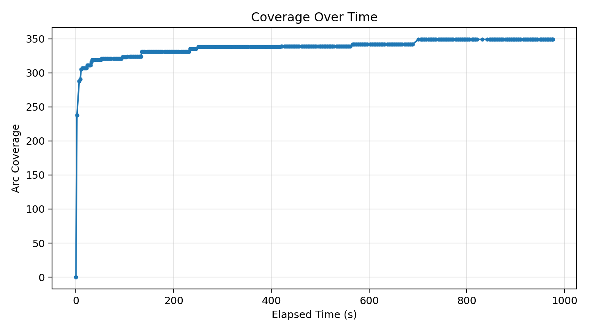
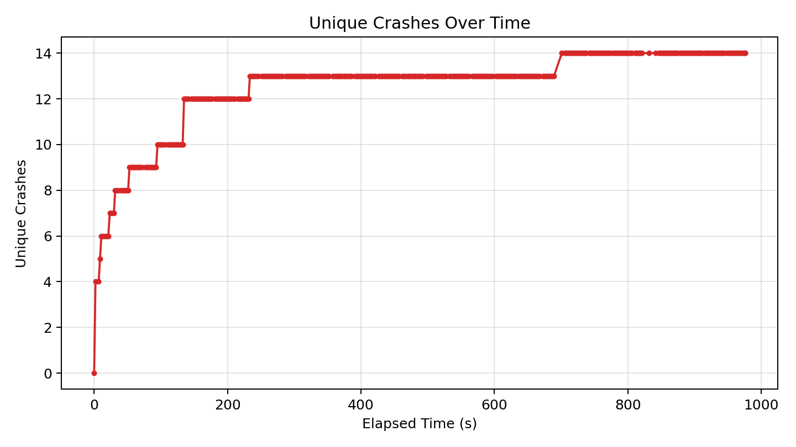
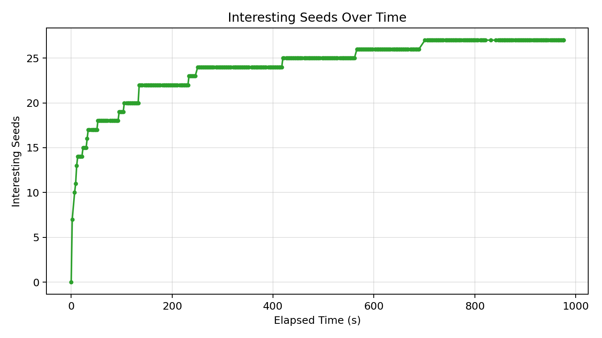

# Fuzzer Run Report (20260417_021341)

_Generated at: 2026-04-17T02:29:58_

## Summary

- **Executions:** 18734
- **Corpus Size:** 28
- **Unique Crashes:** 14
- **Line Coverage:** 281/498 (56.43%)
- **Branch Coverage:** 77/172 (44.77%)
- **Arc Coverage:** 349/590 (59.15%)
- **Exec/s:** 19.19

## Graphs

### Coverage Over Time

### Unique Crashes Over Time

### Interesting Seeds Over Time

## Crash Summary

| Category | Exception | Location | Total Hits | Variants |
|---|---|---|---:|---:|
| bonus_untracked | buggy_json.decoder_stv.JSONDecodeError | targets/json-decoder/buggy_json/decoder_stv.py:257 | 3517 | 1 |
| bonus_untracked | buggy_json.decoder_stv.JSONDecodeError | targets/json-decoder/buggy_json/decoder_stv.py:267 | 3192 | 1 |
| bonus_untracked | buggy_json.decoder_stv.JSONDecodeError | targets/json-decoder/buggy_json/decoder_stv.py:384 | 2111 | 1 |
| bonus_untracked | buggy_json.decoder_stv.JSONDecodeError | targets/json-decoder/buggy_json/decoder_stv.py:210 | 931 | 1 |
| bonus_untracked | buggy_json.decoder_stv.JSONDecodeError | targets/json-decoder/buggy_json/decoder_stv.py:115 | 680 | 1 |
| bonus_untracked | buggy_json.decoder_stv.JSONDecodeError | targets/json-decoder/buggy_json/decoder_stv.py:369 | 652 | 1 |
| bonus_untracked | buggy_json.decoder_stv.JSONDecodeError | targets/json-decoder/buggy_json/decoder_stv.py:196 | 477 | 1 |
| bonus_untracked | buggy_json.decoder_stv.JSONDecodeError | targets/json-decoder/buggy_json/decoder_stv.py:185 | 390 | 1 |
| bonus_untracked | buggy_json.decoder_stv.JSONDecodeError | targets/json-decoder/buggy_json/decoder_stv.py:101 | 249 | 1 |
| bonus_untracked | buggy_json.decoder_stv.JSONDecodeError | targets/json-decoder/buggy_json/decoder_stv.py:224 | 100 | 1 |
