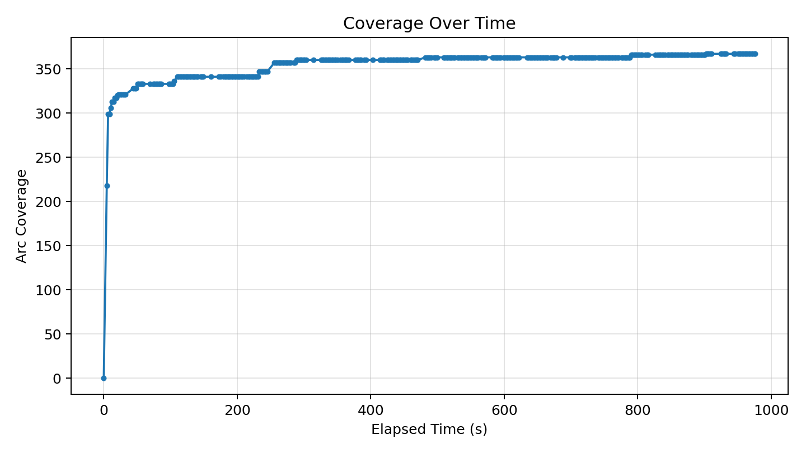
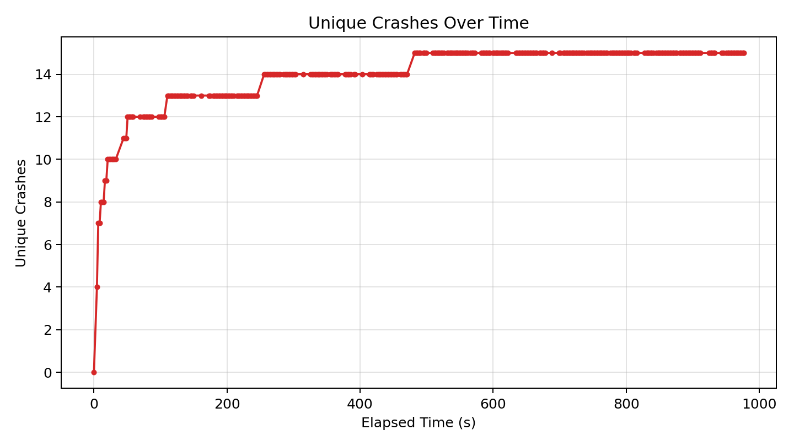
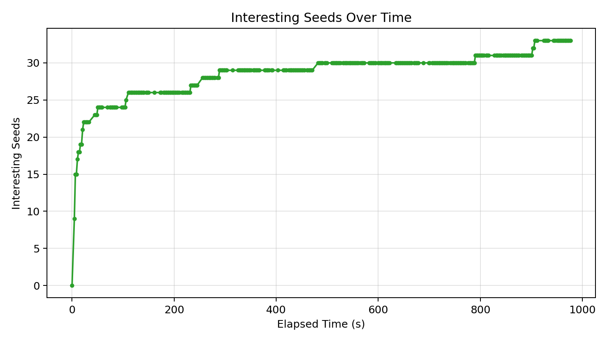

# Fuzzer Run Report (20260417_023036)

_Generated at: 2026-04-17T02:46:53_

## Summary

- **Executions:** 20928
- **Corpus Size:** 34
- **Unique Crashes:** 15
- **Line Coverage:** 294/498 (59.04%)
- **Branch Coverage:** 79/172 (45.93%)
- **Arc Coverage:** 367/590 (62.20%)
- **Exec/s:** 21.43

## Graphs

### Coverage Over Time

### Unique Crashes Over Time

### Interesting Seeds Over Time

## Crash Summary

| Category | Exception | Location | Total Hits | Variants |
|---|---|---|---:|---:|
| bonus_untracked | buggy_json.decoder_stv.JSONDecodeError | targets/json-decoder/buggy_json/decoder_stv.py:384 | 4378 | 1 |
| bonus_untracked | buggy_json.decoder_stv.JSONDecodeError | targets/json-decoder/buggy_json/decoder_stv.py:101 | 1504 | 1 |
| bonus_untracked | buggy_json.decoder_stv.JSONDecodeError | targets/json-decoder/buggy_json/decoder_stv.py:257 | 1359 | 1 |
| bonus_untracked | buggy_json.decoder_stv.JSONDecodeError | targets/json-decoder/buggy_json/decoder_stv.py:369 | 1033 | 1 |
| bonus_untracked | buggy_json.decoder_stv.JSONDecodeError | targets/json-decoder/buggy_json/decoder_stv.py:210 | 574 | 1 |
| bonus_untracked | buggy_json.decoder_stv.JSONDecodeError | targets/json-decoder/buggy_json/decoder_stv.py:267 | 517 | 1 |
| bonus_untracked | buggy_json.decoder_stv.JSONDecodeError | targets/json-decoder/buggy_json/decoder_stv.py:136 | 430 | 1 |
| bonus_untracked | buggy_json.decoder_stv.JSONDecodeError | targets/json-decoder/buggy_json/decoder_stv.py:196 | 375 | 1 |
| bonus_untracked | buggy_json.decoder_stv.JSONDecodeError | targets/json-decoder/buggy_json/decoder_stv.py:224 | 253 | 1 |
| bonus_untracked | buggy_json.decoder_stv.JSONDecodeError | targets/json-decoder/buggy_json/decoder_stv.py:185 | 248 | 1 |
