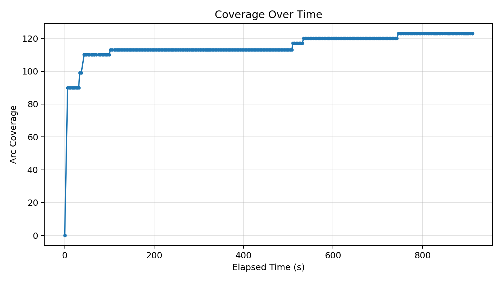
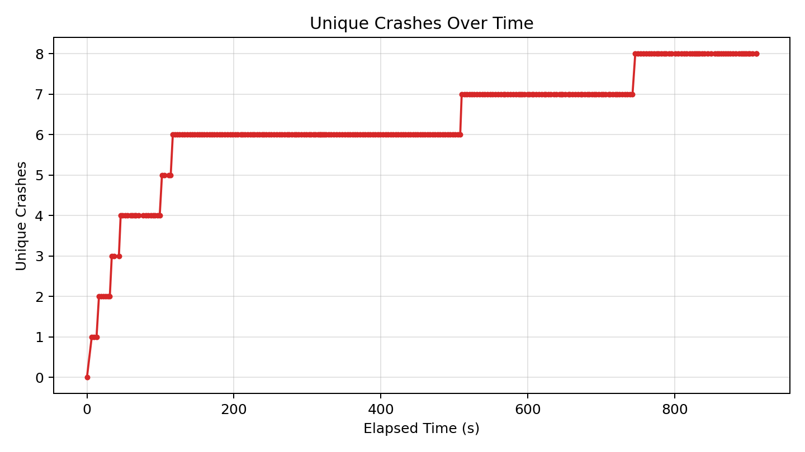
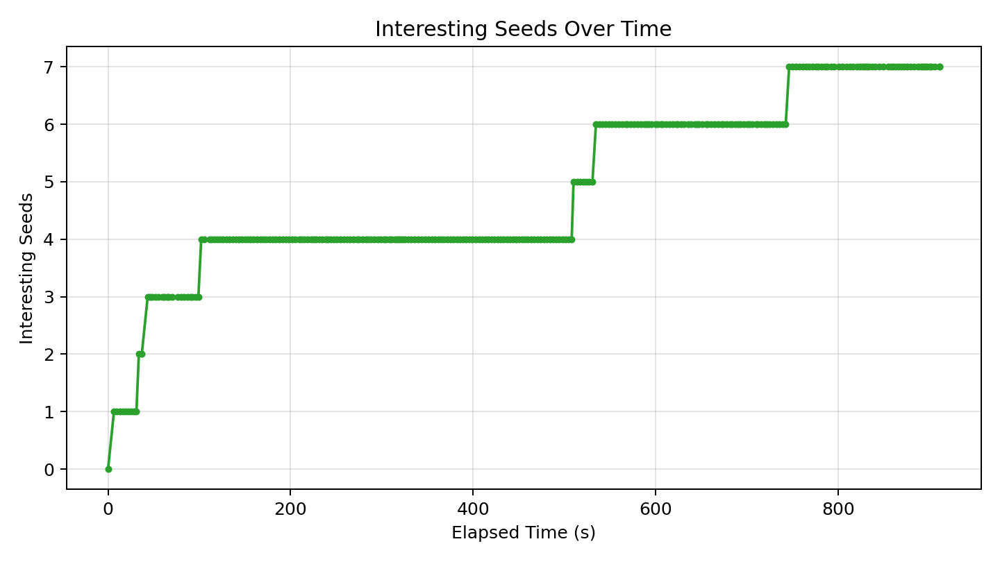

# Fuzzer Run Report (20260417_234005)

_Generated at: 2026-04-17T23:55:18_

## Summary

- **Executions:** 471
- **Corpus Size:** 8
- **Unique Crashes:** 8
- **Line Coverage:** 92/335 (27.46%)
- **Branch Coverage:** 43/74 (58.11%)
- **Arc Coverage:** 123/375 (32.80%)
- **Exec/s:** 0.52

## Graphs

### Coverage Over Time

### Unique Crashes Over Time

### Interesting Seeds Over Time

## Crash Summary

| Category | Exception | Location | Total Hits | Variants |
|---|---|---|---:|---:|
| invalidity | netaddr.core.AddrFormatError | netaddr/ip/__init__.py:341 | 300 | 1 |
| invalidity | netaddr.core.AddrFormatError | netaddr/ip/__init__.py:1045 | 102 | 1 |
| invalidity | netaddr.core.AddrFormatError | netaddr/ip/__init__.py:1479 | 24 | 1 |
| invalidity | netaddr.core.AddrFormatError | netaddr/ip/__init__.py:348 | 9 | 1 |
| unknown | AttributeError | buggy_cidrize/cidrize_stv.py:492 | 8 | 1 |
| invalidity | buggy_cidrize.cidrize_stv.InvalidCidrFormatError | buggy_cidrize/cidrize_stv.py:254 | 3 | 1 |
| invalidity | netaddr.core.AddrFormatError | netaddr/ip/glob.py:79 | 1 | 1 |
| performance | buggy_cidrize.cidrize_stv.PerformanceBug | buggy_cidrize/cidrize_stv.py:421 | 1 | 1 |
