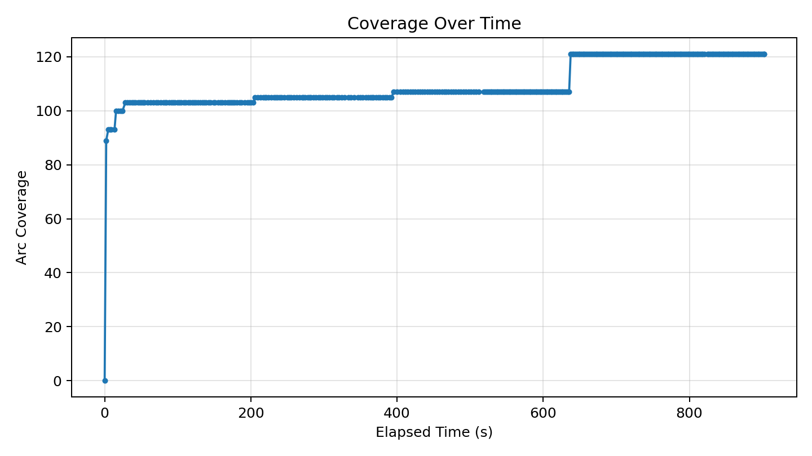
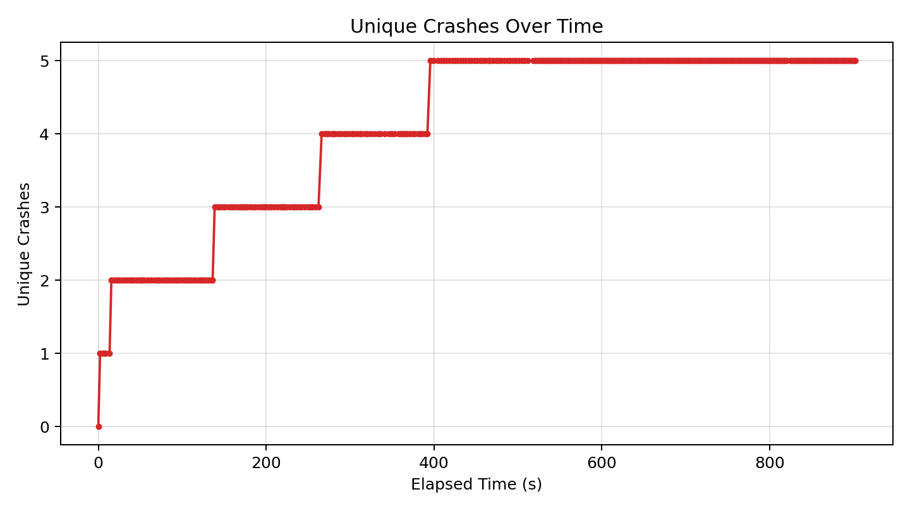
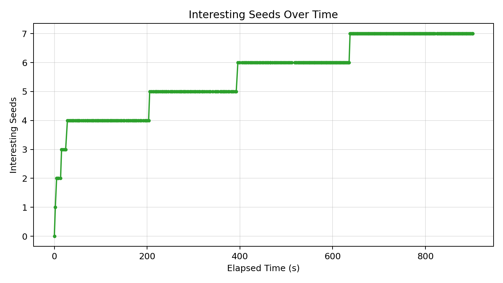

# Fuzzer Run Report (20260417_235934)

_Generated at: 2026-04-18T00:14:36_

## Summary

- **Executions:** 431
- **Corpus Size:** 8
- **Unique Crashes:** 5
- **Line Coverage:** 91/335 (27.16%)
- **Branch Coverage:** 41/74 (55.41%)
- **Arc Coverage:** 121/375 (32.27%)
- **Exec/s:** 0.48

## Graphs

### Coverage Over Time

### Unique Crashes Over Time

### Interesting Seeds Over Time

## Crash Summary

| Category | Exception | Location | Total Hits | Variants |
|---|---|---|---:|---:|
| invalidity | netaddr.core.AddrFormatError | netaddr/ip/__init__.py:1045 | 336 | 1 |
| invalidity | netaddr.core.AddrFormatError | netaddr/ip/glob.py:79 | 23 | 1 |
| performance | buggy_cidrize.cidrize_stv.PerformanceBug | buggy_cidrize/cidrize_stv.py:421 | 8 | 1 |
| validity | buggy_cidrize.cidrize_stv.ValidityBug | buggy_cidrize/cidrize_stv.py:480 | 4 | 1 |
| reliability | buggy_cidrize.cidrize_stv.ReliabilityBug | buggy_cidrize/cidrize_stv.py:302 | 2 | 1 |
