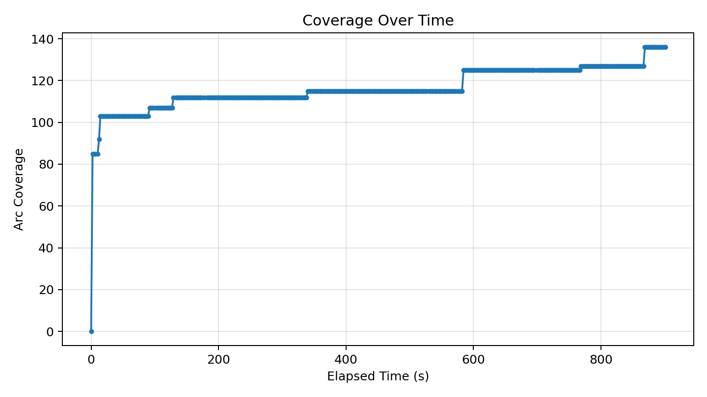
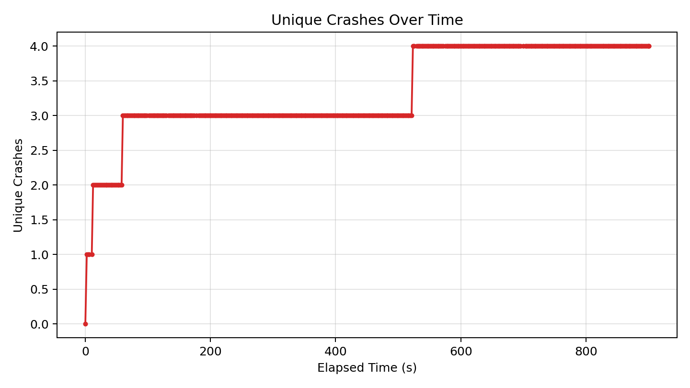
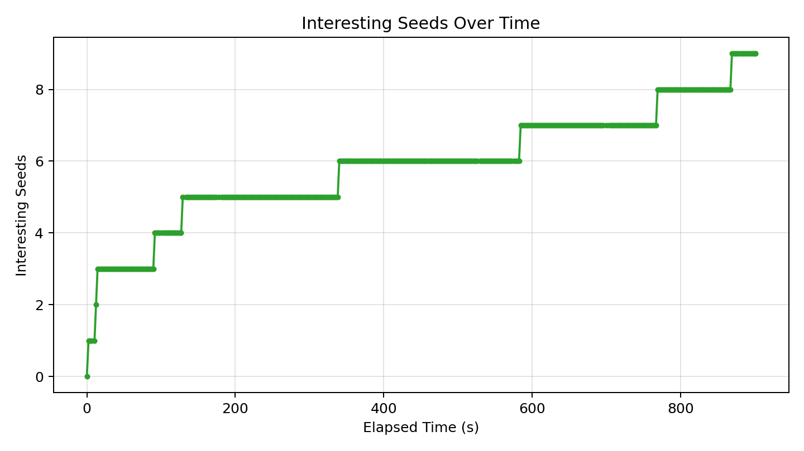

# Fuzzer Run Report (20260418_001652)

_Generated at: 2026-04-18T00:31:54_

## Summary

- **Executions:** 427
- **Corpus Size:** 10
- **Unique Crashes:** 4
- **Line Coverage:** 102/335 (30.45%)
- **Branch Coverage:** 44/74 (59.46%)
- **Arc Coverage:** 136/375 (36.27%)
- **Exec/s:** 0.47

## Graphs

### Coverage Over Time

### Unique Crashes Over Time

### Interesting Seeds Over Time

## Crash Summary

| Category | Exception | Location | Total Hits | Variants |
|---|---|---|---:|---:|
| invalidity | netaddr.core.AddrFormatError | netaddr/ip/glob.py:79 | 199 | 1 |
| invalidity | netaddr.core.AddrFormatError | netaddr/ip/__init__.py:1045 | 142 | 1 |
| invalidity | netaddr.core.AddrFormatError | netaddr/ip/__init__.py:341 | 19 | 1 |
| invalidity | netaddr.core.AddrFormatError | netaddr/ip/__init__.py:348 | 1 | 1 |
