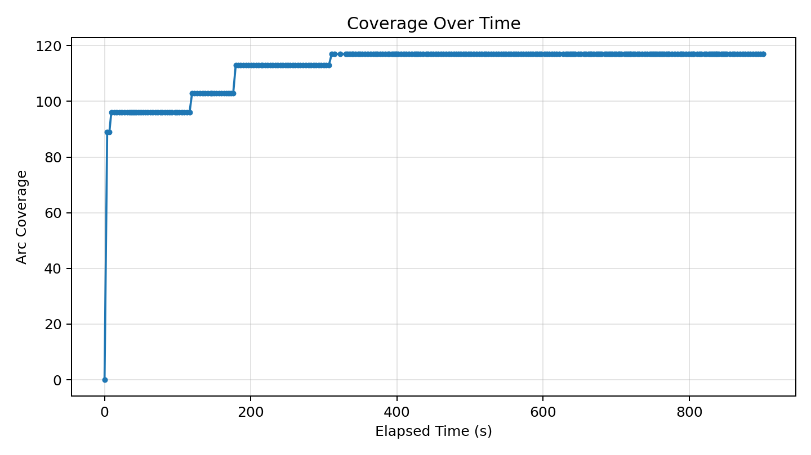
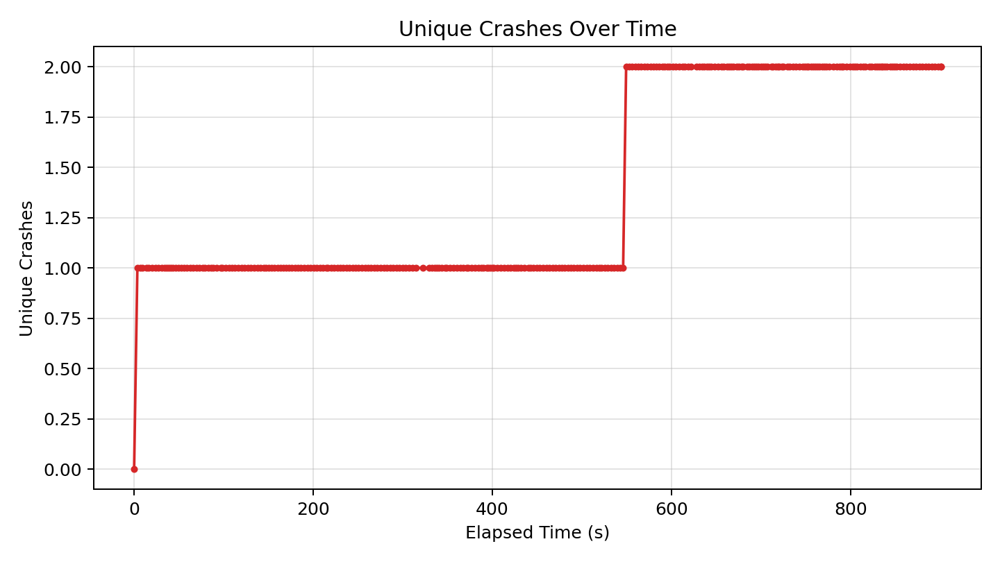
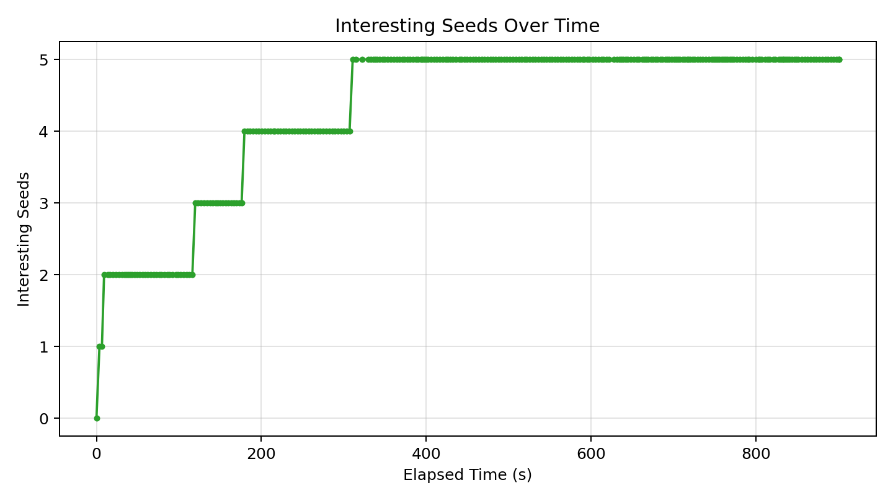

# Fuzzer Run Report (20260418_012425)

_Generated at: 2026-04-18T01:39:27_

## Summary

- **Executions:** 460
- **Corpus Size:** 6
- **Unique Crashes:** 2
- **Line Coverage:** 88/335 (26.27%)
- **Branch Coverage:** 39/74 (52.70%)
- **Arc Coverage:** 117/375 (31.20%)
- **Exec/s:** 0.51

## Graphs

### Coverage Over Time

### Unique Crashes Over Time

### Interesting Seeds Over Time

## Crash Summary

| Category | Exception | Location | Total Hits | Variants |
|---|---|---|---:|---:|
| invalidity | netaddr.core.AddrFormatError | netaddr/ip/__init__.py:1045 | 368 | 1 |
| reliability | buggy_cidrize.cidrize_stv.ReliabilityBug | buggy_cidrize/cidrize_stv.py:302 | 1 | 1 |
