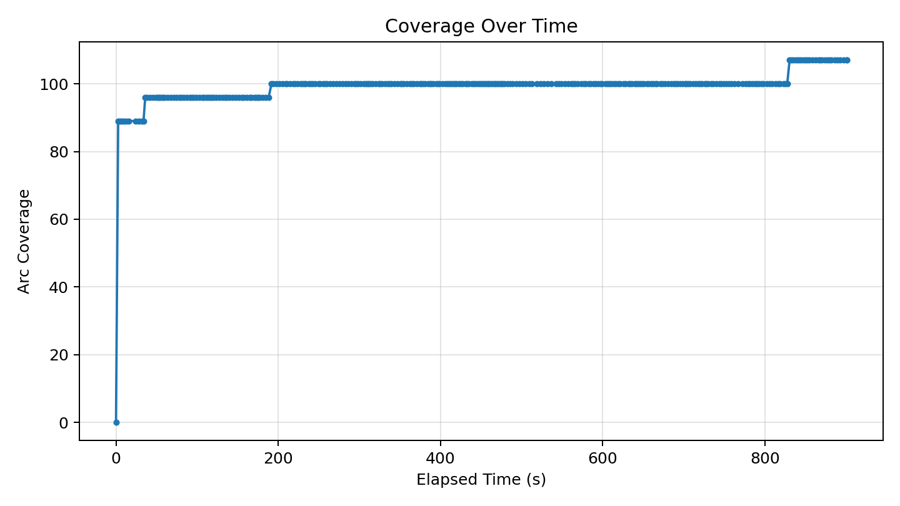
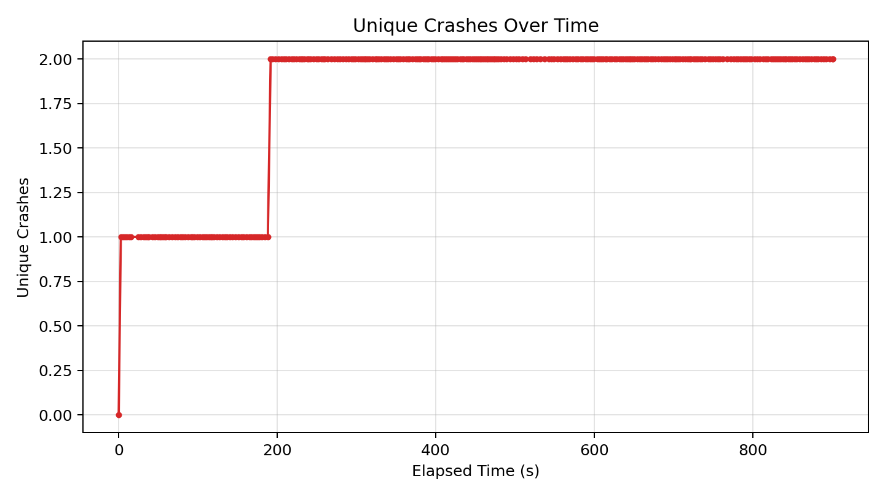
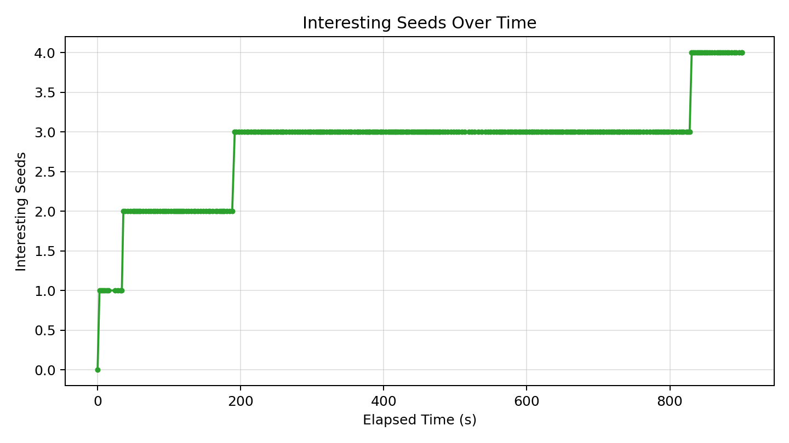

# Fuzzer Run Report (20260418_014519)

_Generated at: 2026-04-18T02:00:20_

## Summary

- **Executions:** 395
- **Corpus Size:** 5
- **Unique Crashes:** 2
- **Line Coverage:** 83/335 (24.78%)
- **Branch Coverage:** 31/74 (41.89%)
- **Arc Coverage:** 107/375 (28.53%)
- **Exec/s:** 0.44

## Graphs

### Coverage Over Time

### Unique Crashes Over Time

### Interesting Seeds Over Time

## Crash Summary

| Category | Exception | Location | Total Hits | Variants |
|---|---|---|---:|---:|
| invalidity | netaddr.core.AddrFormatError | netaddr/ip/__init__.py:1045 | 363 | 1 |
| performance | buggy_cidrize.cidrize_stv.PerformanceBug | buggy_cidrize/cidrize_stv.py:432 | 12 | 1 |
