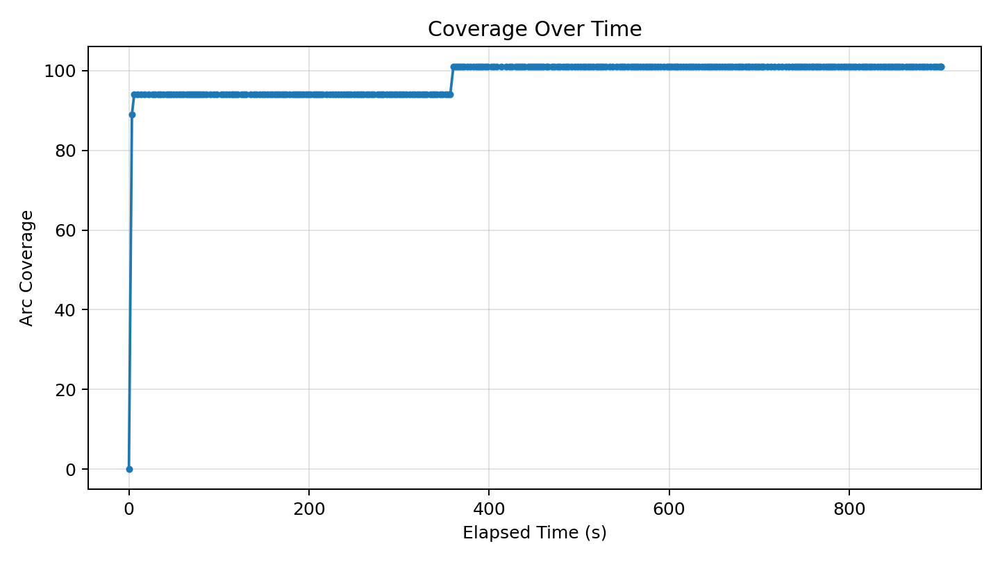
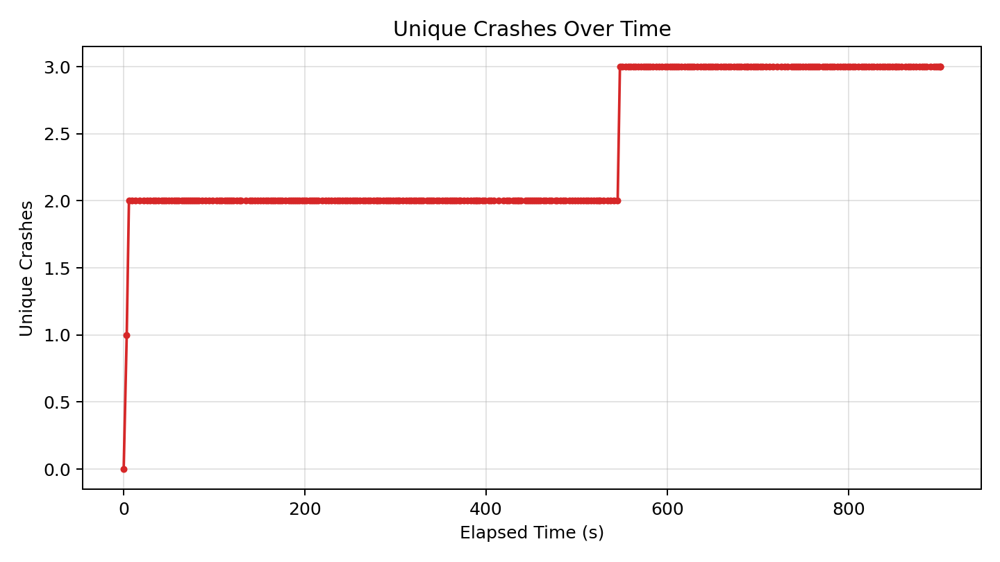
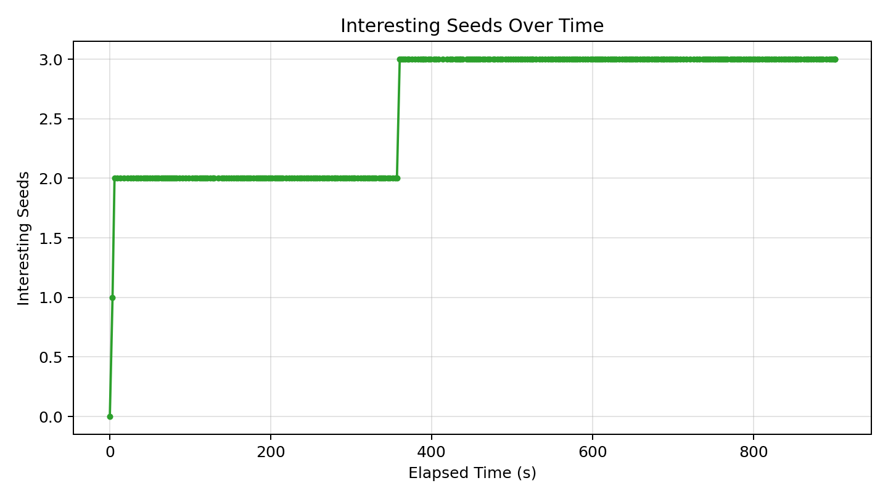

# Fuzzer Run Report (20260418_021226)

_Generated at: 2026-04-18T02:27:29_

## Summary

- **Executions:** 355
- **Corpus Size:** 4
- **Unique Crashes:** 3
- **Line Coverage:** 79/335 (23.58%)
- **Branch Coverage:** 30/74 (40.54%)
- **Arc Coverage:** 101/375 (26.93%)
- **Exec/s:** 0.39

## Graphs

### Coverage Over Time

### Unique Crashes Over Time

### Interesting Seeds Over Time

## Crash Summary

| Category | Exception | Location | Total Hits | Variants |
|---|---|---|---:|---:|
| invalidity | netaddr.core.AddrFormatError | netaddr/ip/__init__.py:1045 | 254 | 1 |
| invalidity | netaddr.core.AddrFormatError | netaddr/ip/__init__.py:341 | 94 | 1 |
| invalidity | netaddr.core.AddrFormatError | netaddr/ip/__init__.py:348 | 2 | 1 |
