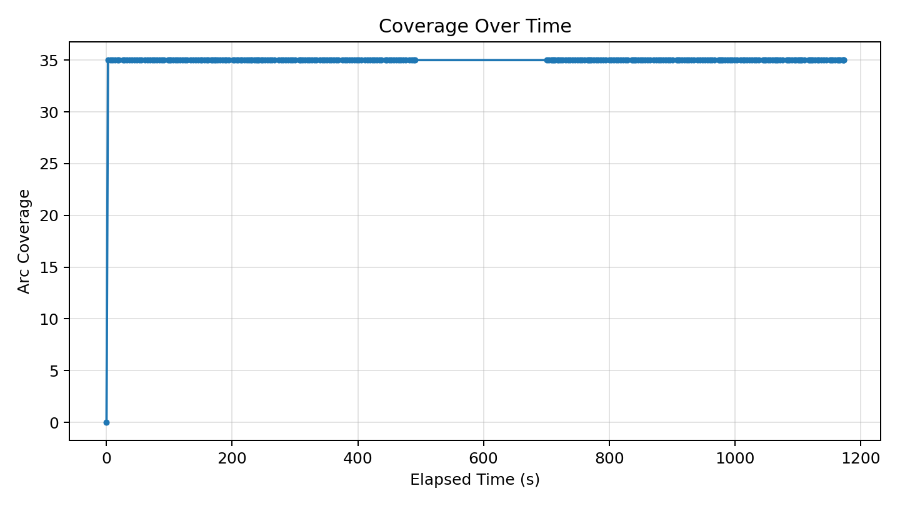
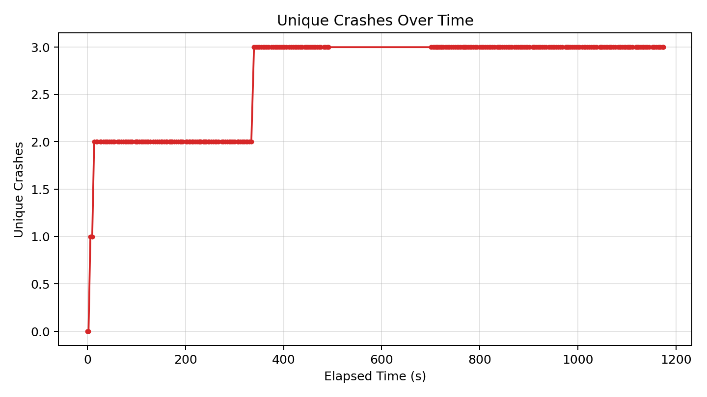
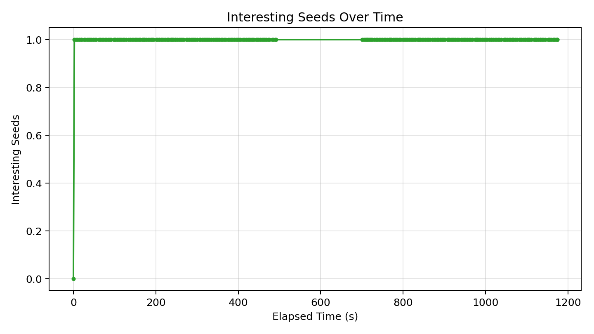

# Fuzzer Run Report (ipyparse4_3_20260417)

_Generated at: 2026-04-23T14:33:38_

## Summary

- **Executions:** 471
- **Corpus Size:** 2
- **Unique Crashes:** 3
- **Line Coverage:** 30/92 (32.61%)
- **Branch Coverage:** 0/10 (0.00%)
- **Arc Coverage:** 35/99 (35.35%)
- **Exec/s:** 0.40

## Graphs

### Coverage Over Time

### Unique Crashes Over Time

### Interesting Seeds Over Time

## Crash Summary

| Category | Exception | Location | Total Hits | Variants |
|---|---|---|---:|---:|
| unknown | pyparsing.exceptions.ParseException | pyparsing/core.py:1340 | 270 | 1 |
| invalidity | buggy_ipyparse.ipv4_stv.InvalidityBug | buggy_ipyparse/ipv4_stv.py:80 | 66 | 1 |
| functional | buggy_ipyparse.ipv4_stv.FunctionalBug | buggy_ipyparse/ipv4_stv.py:134 | 6 | 1 |
