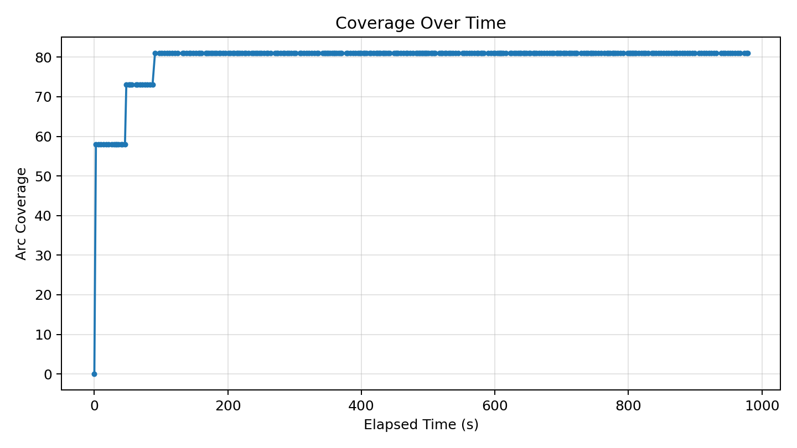
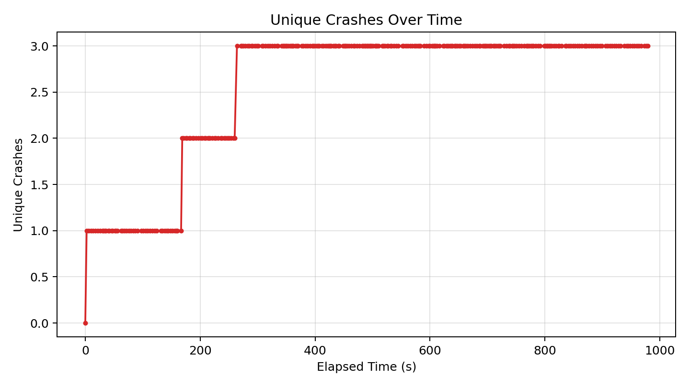
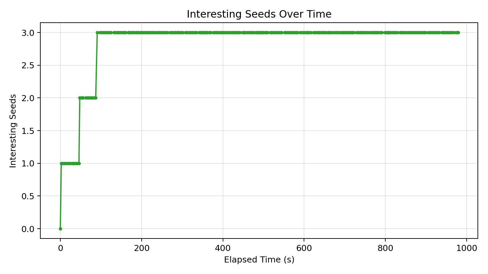

# Fuzzer Run Report (ipyparse6_1_20260417)

_Generated at: 2026-04-23T14:33:38_

## Summary

- **Executions:** 456
- **Corpus Size:** 4
- **Unique Crashes:** 3
- **Line Coverage:** 70/92 (76.09%)
- **Branch Coverage:** 5/10 (50.00%)
- **Arc Coverage:** 81/99 (81.82%)
- **Exec/s:** 0.47

## Graphs

### Coverage Over Time

### Unique Crashes Over Time

### Interesting Seeds Over Time

## Crash Summary

| Category | Exception | Location | Total Hits | Variants |
|---|---|---|---:|---:|
| unknown | pyparsing.exceptions.ParseException | pyparsing/core.py:1340 | 344 | 1 |
| bonus | ParseException | pyparsing/core.py:1340 | 11 | 1 |
| invalidity | buggy_ipyparse.ipv6_mstv.InvalidityBug | buggy_ipyparse/ipv6_mstv.py:93 | 1 | 1 |
