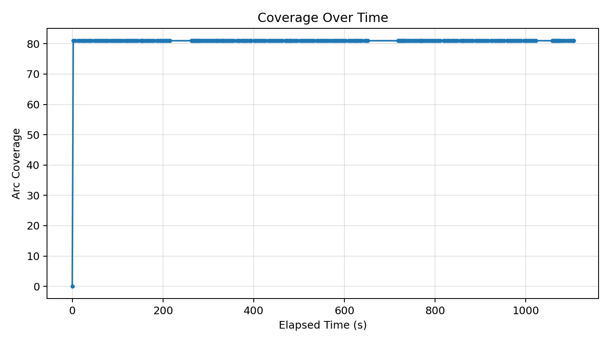
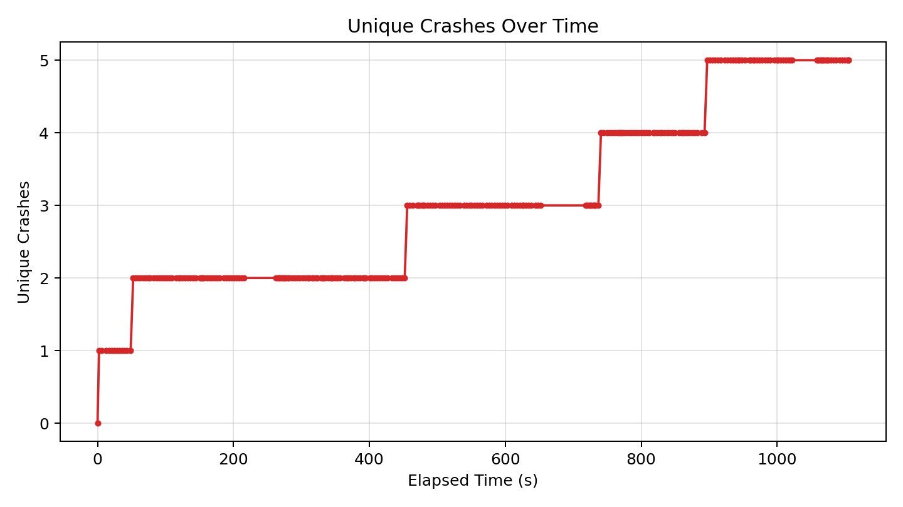
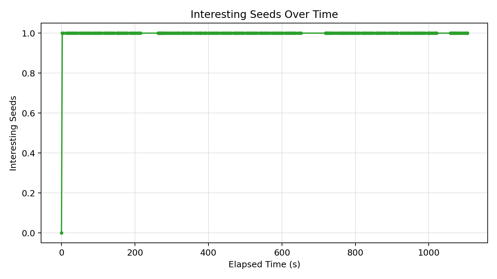

# Fuzzer Run Report (ipyparse6_2_20260417)

_Generated at: 2026-04-23T14:33:39_

## Summary

- **Executions:** 469
- **Corpus Size:** 2
- **Unique Crashes:** 5
- **Line Coverage:** 70/92 (76.09%)
- **Branch Coverage:** 5/10 (50.00%)
- **Arc Coverage:** 81/99 (81.82%)
- **Exec/s:** 0.42

## Graphs

### Coverage Over Time

### Unique Crashes Over Time

### Interesting Seeds Over Time

## Crash Summary

| Category | Exception | Location | Total Hits | Variants |
|---|---|---|---:|---:|
| unknown | pyparsing.exceptions.ParseException | pyparsing/core.py:1340 | 406 | 1 |
| reliability | buggy_ipyparse.ipv6_mstv.ReliabilityBug | buggy_ipyparse/ipv6_mstv.py:126 | 8 | 1 |
| invalidity | buggy_ipyparse.ipv6_mstv.InvalidityBug | buggy_ipyparse/ipv6_mstv.py:93 | 7 | 1 |
| bonus | ParseException | pyparsing/core.py:1340 | 1 | 1 |
| invalidity | buggy_ipyparse.ipv4_mstv.InvalidityBug | buggy_ipyparse/ipv4_mstv.py:81 | 1 | 1 |
